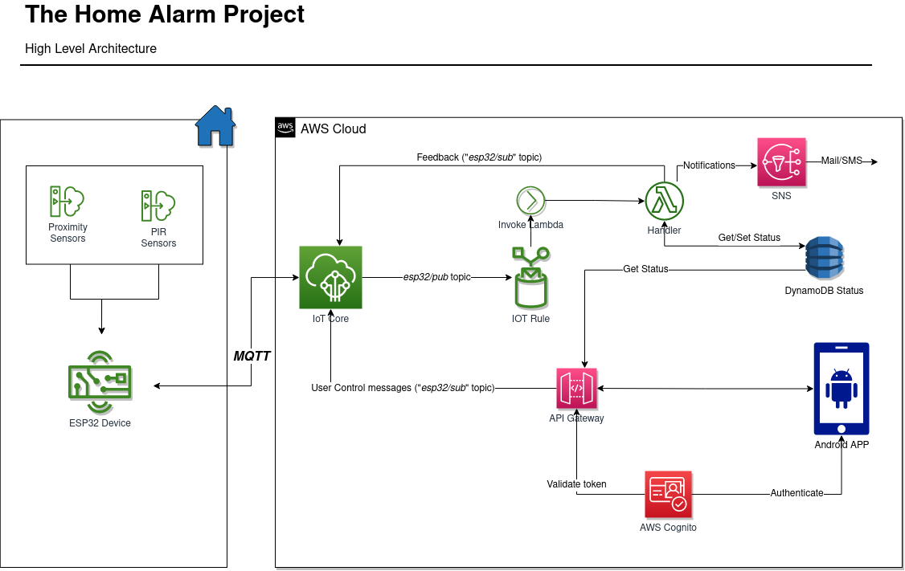

 # HAP
 The HomeAlarmProject is an open source end-to-end solution for building a home alarm system, leveraging low costs hardware and software.
 It was a funny personal project and so I decided to share it with the community, hoping someone could find it useful :)
 

 The solution is based on 3 macro-components:
  - An ESP32 device for processing signals from home sensors and communicating to the cloud
  - AWS Services for inbound/outbound communication and for alarm triggering logics
  - An Android Mobile App as a very simple User Interface for Monitoring and Controlling

## Prerequisites
### AWS Setup
In the *aws* folder you'll find some cloudformation scripts to provision all AWS resources.
However, there's still a manual step you should execute from the AWS Console, which is related to the creation of the IOT-Certificates.
This can be done within the AWS Console, under the *"AWS IoT -> Security -> Certificates"* section. From there, you must:
 1. Create a new Certificate (use autogenerated recommended approach)
 2. Download the 3 certificate files (Thing Private RSA KEY, Thing Certificate, Root CA)
 3. Take also note of the Thing Certificate name because you'll need it later

### Development Tools
Here there are the main tools you'll need to build and run the solution
 - VSCode + Arduino Extension\
  To build and program the ESP32 device, you have at least a couple of options (Arduino official IDE vs VSCode).
  I have used Visual Studio Code with the Arduino extension without any issues, so this is my suggested configuration
  - Serverless Framework
  - AWS CLI with proper profile configured
  - Android Studio
  - An android device with developer tools turned-on

## Quickstart

### 01 - AWS Services Setup
Follow instructions from [here](aws/README.md)

### 02 - Build and deploy the Esp32 program
Follow instructions from [Here](esp32/README.md)

### 03 - Build and deploy the Android App
Follow instructions from [Here](androidapp/README.md)

