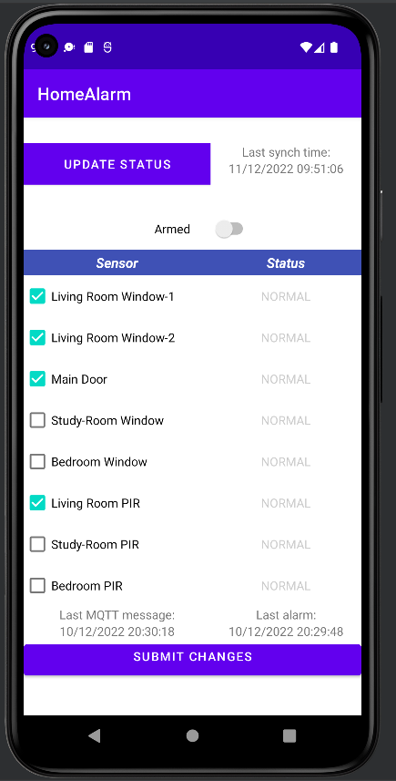

# HAP - Android App

## App Description

This is a very simple Android app you can use for user interaction with the HAP backend.
There are only 2 Activities:
1. Login
2. Main

The purpose of Login activity is just to allow the user authenticate via AWS-Cognito.\
Once you're authenticated, the application goes to the Main activity 

All interactions between the App and the cloud has been implemented via API-Gateway methods.

 - The "UPDATE STATUS" button will query the DynamoDB table via API-Gateway, fetching the current status.
The text field on the right will return the latest syncronization timestamp.
- The "Armed" switch will enable the Alarm logics
- In the central part, you can enable/disable any sensor and send related actions to the ESP32 device via API-Gateway
- The "SUBMIT CHANGES" button will then call the API-Gateway for synch the ESP32 device status accordingly

## Configuration
You will need to change just one configuration file: ["*amplifyconfiguration.json*"](./app/src/main/res/raw/amplifyconfiguration.json) \
Here you will have to edit the following Amplify parameters:
 - *API_ID*: It's the API endpoint you created from Cloudformation stack [here](../aws/04.rest-api.yaml). You can retrieve the API Entpoint with the following command:
    > aws --profile $AWS_PROFILE apigateway get-rest-apis --query "items[?name == 'simpleHomeAlarmApi-rest-api'].{Id:id}" --output text
 - *REGION*: I've used the "eu-west-1" region, but you can use whatever region you prefer
 - *STAGE*: here you can put whatever STAGE name you prefer but please note that in the Cloudformation stack a pre-defined **"test"** stage has been configured for deploy
 - *IDENTITY_POOL_ID*: It's the Cognito Identity Pool ID you created from Cloudformation stack [here](../aws/03.cognito.yaml). You can retrieve such ID with the following command:
    > aws --profile $AWS_PROFILE cognito-identity list-identity-pools --max-results 10 --query "IdentityPools[?IdentityPoolName == 'simpleCognito-identity-pool'].{Id:IdentityPoolId}" --output text
 - *USER_POOL_ID*: It's the Cognito User Pool ID you created from Cloudformation stack [here](../aws/03.cognito.yaml). You can retrieve such ID with the following command:
    > aws --profile $AWS_PROFILE cognito-idp list-user-pools --query "UserPools[?Name == 'simpleCognito-user-pool'].{Id:Id}" --max-results 10 --output text
 - *APP_CLIENT_ID*: It's the APP Client ID you created from Cloudformation stack [here](../aws/03.cognito.yaml). You can retrieve such ID with the following command:
    > aws --profile $AWS_PROFILE cognito-idp list-user-pool-clients --user-pool-id \$UPID --query "UserPoolClients[].ClientId" --output text

## Build and deploy
 - Enable Developer tool on your Android smartphone
 - Connect the smartphone via USB (Android Studio should detect the smartphone automatically)
 - Build and deploy the app from the IDE (shift+F10 should do the job)

