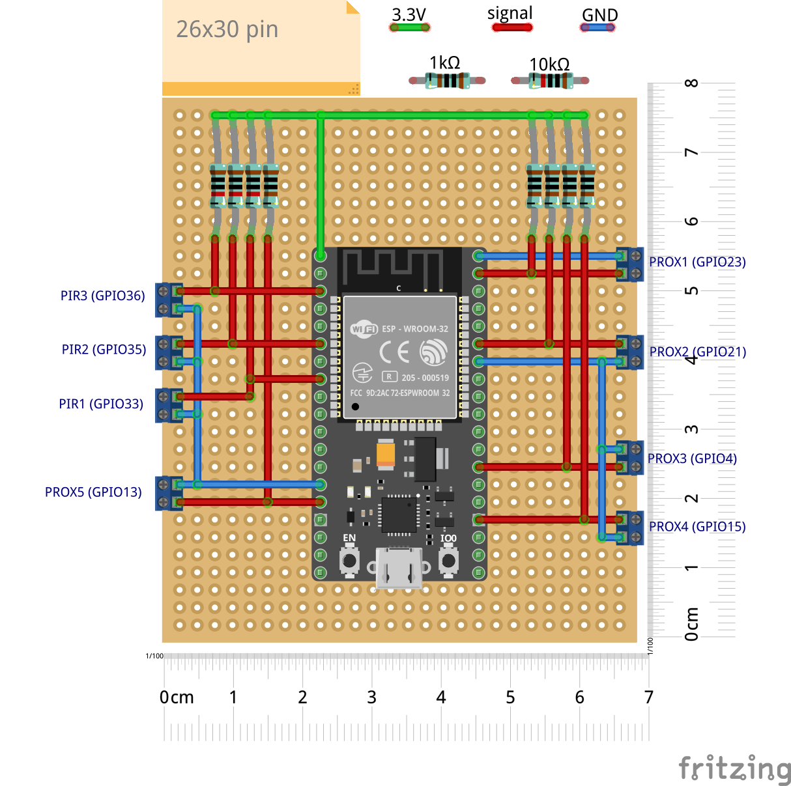
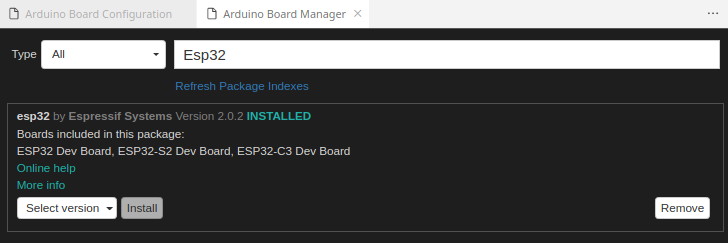
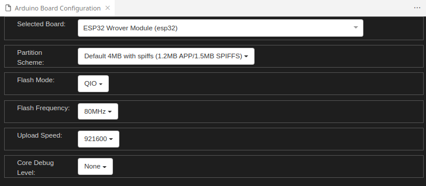

# HAP - ESP32 Build

## Intro
Within this folder you'll find the Arduino-based project for my ESP32 device, monitoring and controlling the Alarm Sensors.
The board project has been designed with "Fritzing". You'll find the source project into the "*board_design*" folder.
Please find below the overall wiring schema:

## Board
I've used a Freenove product which is based on the Espressif *ESP32-WROVER-E* module.\
There a lot of store online where you can buy such board.

## Prerequisites
 1. Download generated certificates from the AWS Console as described [here](../README.md#aws-setup)
 2. Get the IOT Endpoint: you can easily do this by the following command:
   > aws iot describe-endpoint --endpoint-type iot:Data-ATS --output text | cut -d "-" -f 1
 3. Edit the *ZZ_SimpleHomeAlarmProjectCredentials.h* file. The following variables should be modified:
    - WIFI_SSID
    - WIFI_PASSWORD
    - AWS_IOT_ENDPOINT (from step 3)
    - AWS_CERT_CA (from step 1)
    - AWS_CERT_PRIVATE (from step 1)
    - AWS_CERT_CRT (from step 1)

4. From VSCode, add the "esp32" Board Configuration

If you don't find the esp32 board configuration, probably you have to add the following additional URL:
"https://raw.githubusercontent.com/espressif/arduino-esp32/gh-pages/package_esp32_index.json"

5. From VSCode Arduino Board Configuration, select the "ESP32 Wrover Module" from the available list

6. Add the following libraries using the Arduino Library Manager:
 - MQTT (by Joel Gaehwiler), Version 2.5.0
 - ArduinoJson (by Benoit Blanchon) Version 6.20.0
 - Time (by Michael Margolis), Version 1.6.1 
 - Logger (by Christopher Baker), Version 1.0.3

7. Connect the board to the PC via USB and select the serial port from VSCode
   Sometimes you could experience some "*permission denied*" issues. If you search online, you should easily find a solution for such issues.

8. Build and upload the code to the ESP32 Device